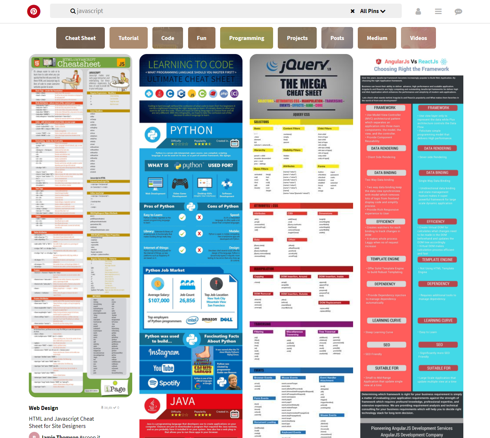

# Pinterest

## Introducción

Se pidio realizar el maquetado de Pinterest.

## Desarrollo

* Se utilizó los conocimientos del floats, tambien se fue definiendo a cada
section un ancho estático para que los siguientes elementos que se agregaran después
de cada artículo.
* Tambien se importo iconos de FontAwesome, y el uso de tipográfias.

## Se utilizó
`html` `css`

)

## Créditos
 * [Danielapariona](https://github.com/Danielapariona)
